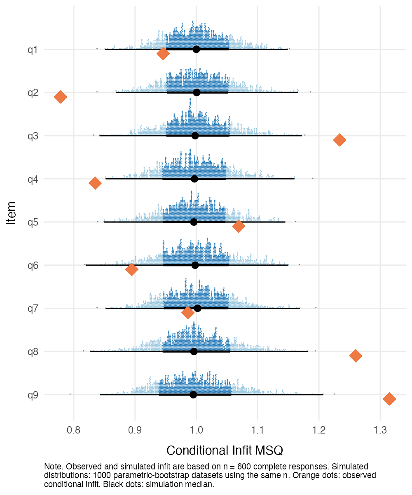
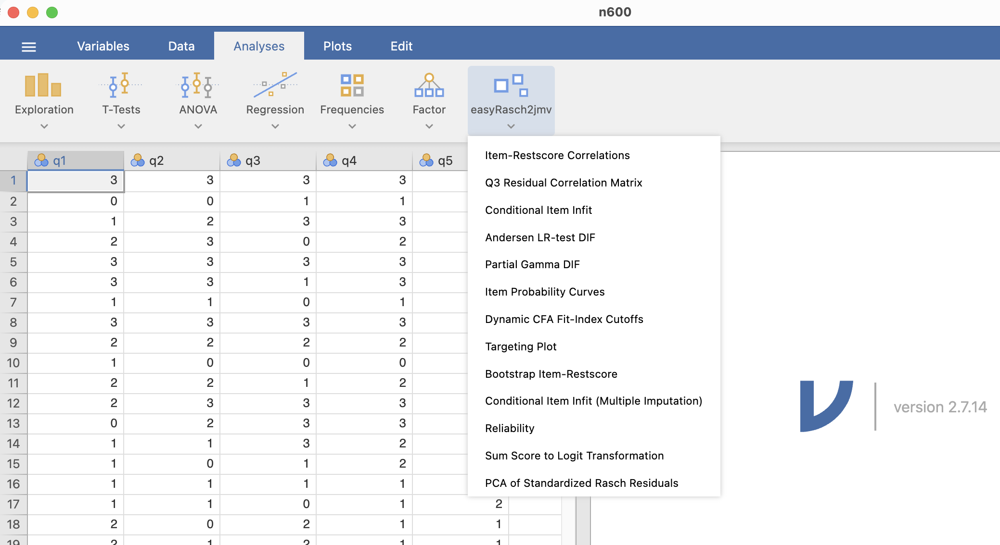
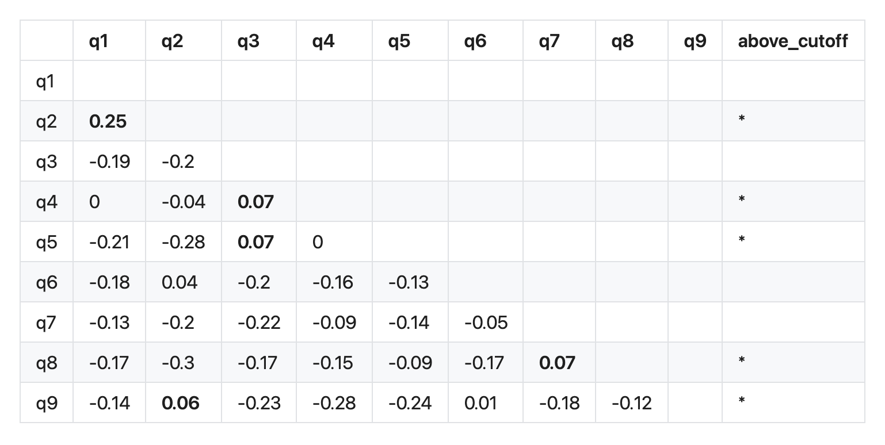
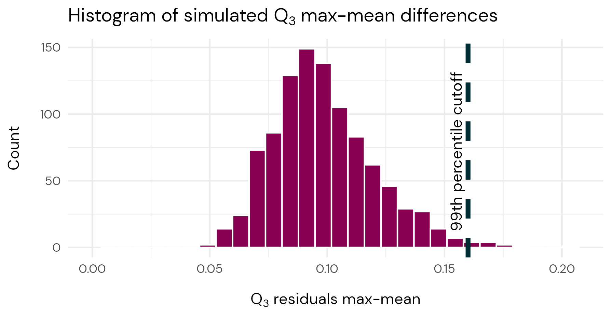
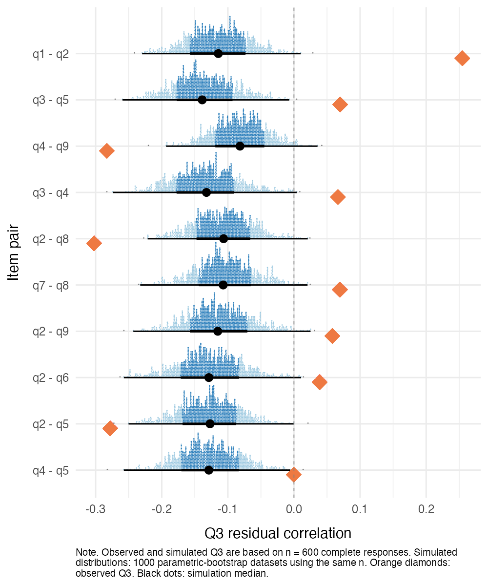
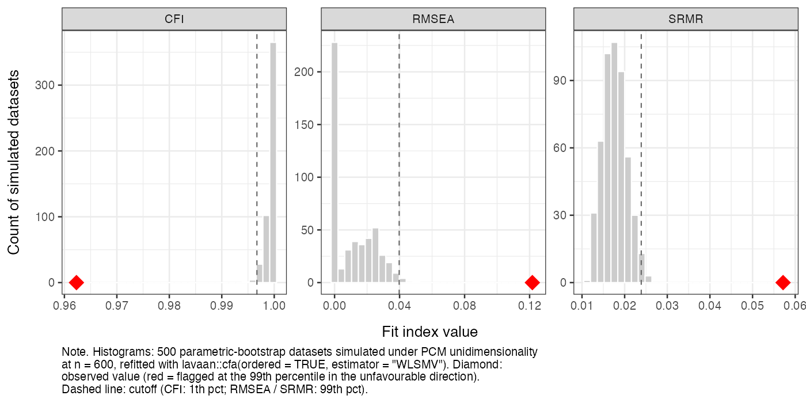
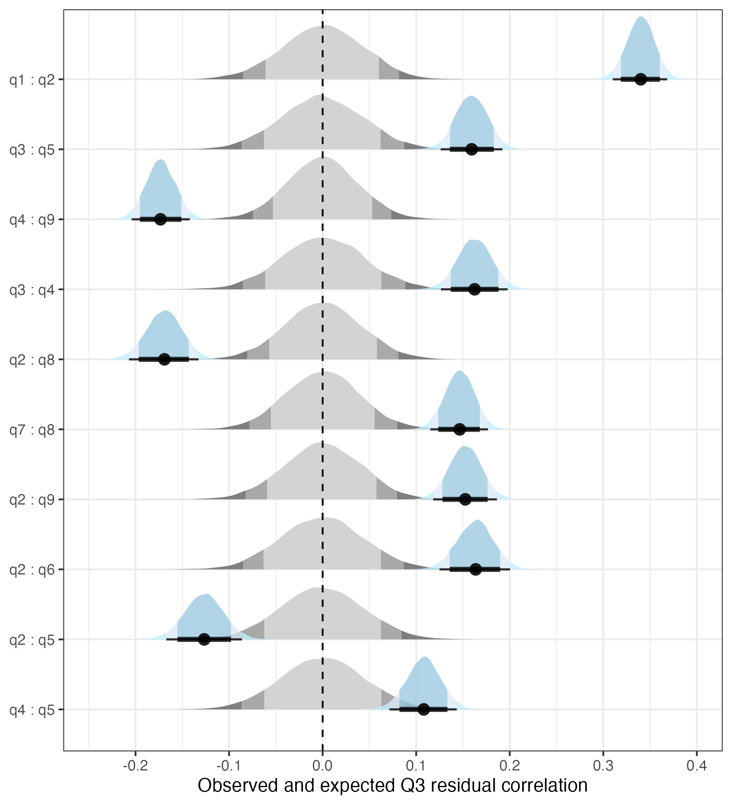

## The issue at hand

Two things we always grapple with:

- **Evaluating model–data fit** [[@christensen_psychometric_2021]]{style="font-size:0.7em"}
  * unidimensionality
  * local independence
  * ordered response categories
  * invariance
- **Using adequate methods** 
  * with appropriate interpretations

## Before diving in...

[**Scope**]{style="font-size:1.3em"}

- Examples are from **Rasch Measurement Theory** (RMT) — focusing on
unidimensionality and item fit, and local (in)dependence.
- But the concepts and general methods apply to any measurement model.

This will be a non-technical presentation, focused on results and recommendations rather than explanations and details.

## Traditional workflow {.blue}

- We evaluate fit with metrics such as **item fit statistics** and **$Q_3$ residuals**
- But how do we decide what counts as *misfit*?

. . .

**Critical values — a.k.a. "cutoffs"**

- Rule-of-thumb cutoffs dominate practice…
- …despite strong evidence that they depend on sample size, number of
  items, and more

**A better solution** - *Simulation-based cutoffs*

## Key takeaways

Sorry for the bluntness...

. . .

- *Don't use rule-of-thumb cutoffs* to interpret your item/model fit
  - **WRONG**: Item infit/outfit MSQ within 0.5-1.5 or 0.7-1.3
  - **WRONG**: PCA eigenvalue below 2.0 (or < 1.5) [[@chou_checking_2010]]{style="font-size:0.7em"}
  - **WRONG**: Local dependence ($Q_3$) above 0.3, or 0.2 above mean
  - **WRONG**: Confirmatory factor analysis RMSEA/SRMR/CFI/TLI cutoffs based on **Hu & Bentler (1999)**, or any other fixed value
- Large sample sizes (*n* > 1000) require special treatment for some metrics
- Easy to use software that solves these issues is now available

## A measurement model is a data-generating procedure (DGP) {.ljusbla}

- A fitted model can be used to *generate* item-response data.
- We can simulate data using model parameters to approximate the **expected distribution of any fit metric**.

## Data-adaptive cutoffs

- Estimate item & person parameters from **your** sample and items
- The simulations are tailored to mimic your data — and so is the
  expected distribution of the fit metric
- Compare the **observed** metric to the **expected** distribution — *voilà!*

::: {.callout-note appearance="simple"}
Simulating from model parameters estimated on data = **parametric bootstrap**.
:::

## Simulation-based workflow {.blue}

Setup:

1. Start with the dataset being analyzed
2. Estimate item & person (model) parameters from observed data

Simulation:

3. Resample person parameters ($\theta$) with replacement
4. Using the item parameters, simulate item responses
5. Estimate the model parameters 
6. Calculate the fit metric

::: {.callout-note appearance="simple"}
Repeat steps **3–6** many times (~500–1000).
:::

## A visual example

:::: {.columns}
::: {.column width="50%"}
{fig-alt="Ridgeline distributions of conditional infit MSQ for items q1–q9. Blue simulated distributions are centred near 1.0; observed values appear as orange diamonds, with several items falling in the tails."}
:::

::: {.column width="50%"}
**Conditional infit MSQ**

[PHQ-9, *N* = 600]{style="font-size:0.7em"}

- Blue = simulated (expected) distribution
- Orange ♦ = observed value
- Values out in the tails → flagged as underfit (above) or overfit (below)
:::
::::

## How do you get simulation-based cutoffs?

[Free, open-source software! Both of these rely on R packages others built.]{style="font-size:0.8em"}

:::: {.columns}
::: {.column width="50%"}
### jamovi

[jamovi.org](https://www.jamovi.org) — based on R, but with a point-and-click user interface.

- Install the module `easyRasch2jmv` from the built-in jamovi Library.
- Most example images in this presentation are from the jamovi module.
- Available for Mac, Windows, Linux, and ChromeOS
:::

::: {.column width="50%"}
### R

Frequentist and Bayesian Rasch packages **available on [CRAN](https://cran.r-project.org/web/packages/index.html)**, both using expected/observed fit metrics.

For documentation and examples:

- <https://pgmj.github.io/easyRasch2/>
- <https://pgmj.github.io/easyRaschBayes/>
- Click [here](https://pgmj.github.io/rasch_bayes_comp.html) for a comparison.
:::
::::

## jamovi overview

## {background-image="images/jamovi_infit.png" background-size="contain" background-color="#FFFFFF"}

::: footer
:::

## Item fit {.ljusbla}

Two key papers:

- **Müller** [-@muller_item_2020] — on conditional item fit.
- **Johansson** [-@johanssonDetectingItemMisfit2025] — on power to detect misfit due to multidimensionality, using conditional infit/outfit and item–restscore (Goodman–Kruskal's $\gamma$).

::: {.callout-important}
Since unconditional item fit is unreliable with a sample size larger than ~200 [@muller_item_2020] and the detection of misfit items is generally underpowered with sample sizes below 200 [@johanssonDetectingItemMisfit2025], **we should use conditional item infit**. 
:::

## Conditional item fit MSQ [@muller_item_2020] {.ljusbla}

- The paper compares conditional and **unconditional** infit/outfit
- Unconditional item fit is inconsistent from *n* > ~200. 
  - ZSTD transformation of MSQ does not help.
- Unconditional/ZSTD *is what is used in all software unless explicitly noted otherwise*.
- For conditional item fit, standard errors are not consistent → we need bootstrap/simulation to interpret results.

. . .

- **Limitation**: Requires complete response data.
  - Multiple imputation with chained equations (MICE) can be used.
  - MICE is implemented in jamovi module and `easyRasch2`.

## Detecting item misfit [@johanssonDetectingItemMisfit2025] {.ljusbla}

- **Outfit** is much less powerful than conditional **infit** and
  **item–restscore (GK $\gamma$)** in detecting multidimensionality issues (underfit items).
- Conditional infit is slightly more powerful than item-restscore for *n* < 500.
- Off-target items are harder to detect (-2 logits compared to sample mean).
  - +/- 1 logit makes little difference.
- Large samples (*n* > 1000) should use item-restscore with non-parametric bootstrap (available in jamovi & `easyRasch2`).

## Local dependence: $Q_3$ residuals

:::: {.columns}
::: {.column width="50%"}
[Global cutoff vs. separate item pair cutoffs]{style="font-size:0.8em"}

:::

::: {.column width="50%" .fragment}
{fig-alt="Ridgeline distributions of simulated Q3 residuals with observed item-pair values marked, used to judge local dependence against a data-adaptive cutoff."}
:::
::::

## CFA model fit

- Confirmatory factor analysis (CFA) is a test of **dimensionality**.
- Usually judged by several indices — **RMSEA, SRMR, CFI, TLI, etc**.
  - Hu & Bentler (1999): ~150k citations for rule-of-thumb cutoffs.
    - Same issue as other metrics — they don't generalize.
    - And are inappropriate for ordinal data.
- **Simulation-based cutoffs should be used** [@mcneishDirectDiscrepancyDynamic2024].
  - R package `dynamic`; but easier with `easyRasch2` and jamovi module.

. . .

- **Remember to use a correct estimator for ordinal data!**
  - WLSMV, ULSMV, DWLS, etc. [(`lavaan::cfa(data, ordered = TRUE, estimator = "WLSMV")`)]{style="font-size:0.5em"}

## CFA: observed vs. simulated (jamovi) {.ljusbla}

{fig-alt="Three histograms (CFI, RMSEA, SRMR) of 500 parametric-bootstrap datasets simulated under unidimensionality. Observed values, shown as red diamonds, fall far outside the simulated distributions, indicating misfit." fig-align="center" width="92%"}

## Where to draw the line? {.plum}

[**Choosing a cutoff**]{style="font-size:1.3em"}

- Where should we draw the line on the simulated distribution?
  - *p*-value? Which alpha/correction to use?
  - Distribution-based, 95th percentile? 99th? Fully outside the expected range?

. . .

- **Bayesian view:** compare the *expected* distribution to the *posterior* —
  how much do they overlap?
  - What is the probability that data were generated by the model (the DGP)?
- A similar idea works in a frequentist frame, although we have only one observed value to compare with the simulated distribution of expected values.

## $Q_3$ residuals: simulation vs Bayesian

:::: {.columns}
::: {.column width="50%"}
{fig-alt="Ridgeline distributions of simulated Q3 residuals with observed item-pair values marked, used to judge local dependence against a data-adaptive cutoff."}
:::

::: {.column width="50%"}
{fig-alt="..."}
:::
::::

## Takeaways {.blue}

- Rule-of-thumb cutoffs **don't generalize** — they shift with sample size,
  number of items, and more.
- A fitted measurement model is a **DGP** → simulate the expected fit
  distribution.
  * **Data-adaptive, simulation-based cutoffs** via the parametric bootstrap.
- Useful software: **jamovi** + **easyRasch2 / easyRaschBayes** in R.

## Thank you! {.plum .centered}

[**Magnus Johansson, PhD**]{style="font-size:1.2em;"}

Department of Clinical Neuroscience, Karolinska Institutet

* [[https://orcid.org/0000-0003-1669-592X](https://orcid.org/0000-0003-1669-592X)]{style="font-size:0.9em;"}
* [[https://ki.se/en/people/magnus-johansson-3](https://ki.se/en/people/magnus-johansson-3)]{style="font-size:0.9em;"}

:::: {.columns}
::: {.column width="50%"}
{width=33%}
 
[Slides: <https://pgmj.github.io/SAMC2026/>]{style="font-size:0.5em; text-align:left;"}
 
[Code: <https://github.com/pgmj/SAMC2026/>]{style="font-size:0.5em; text-align:left;"}

:::

::: {.column width="50%"}

:::
::::
## References